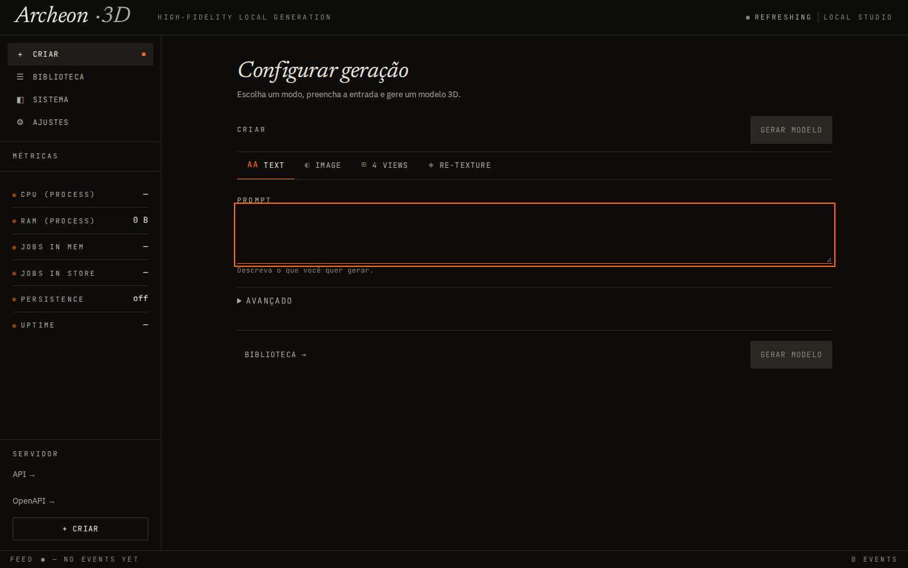
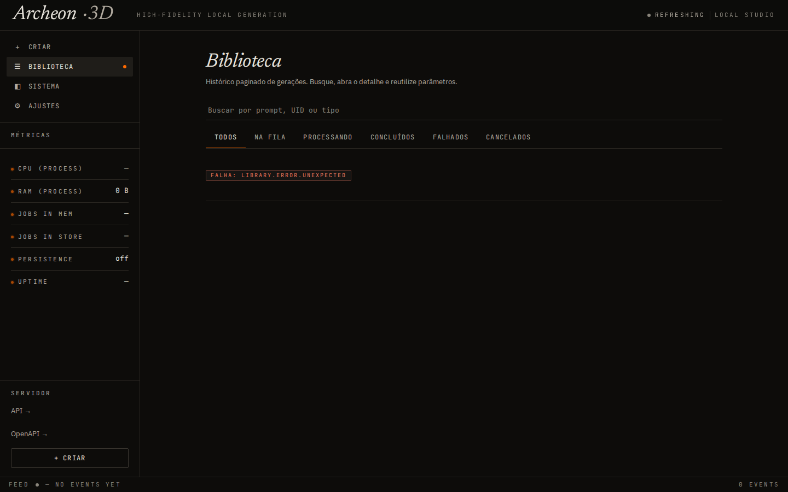
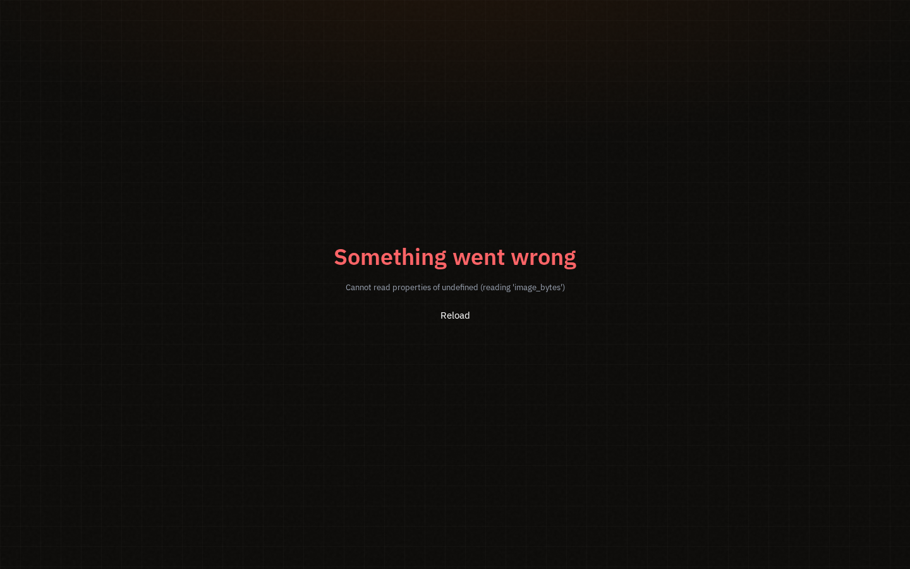
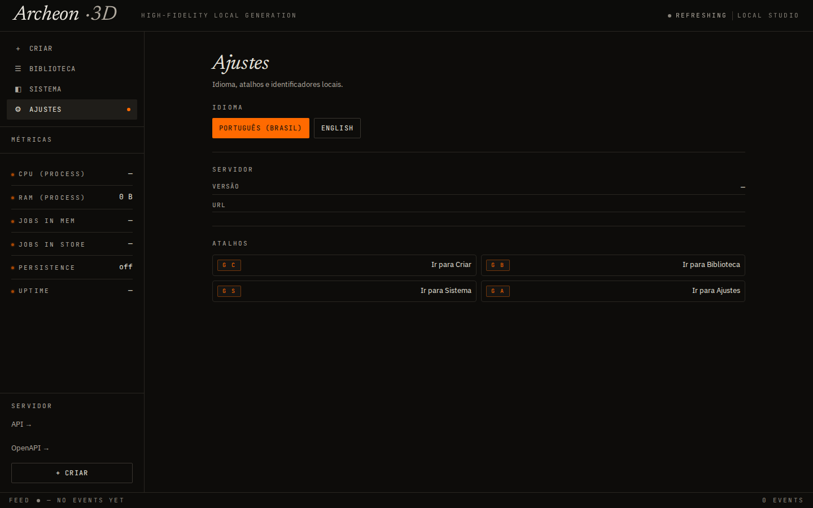
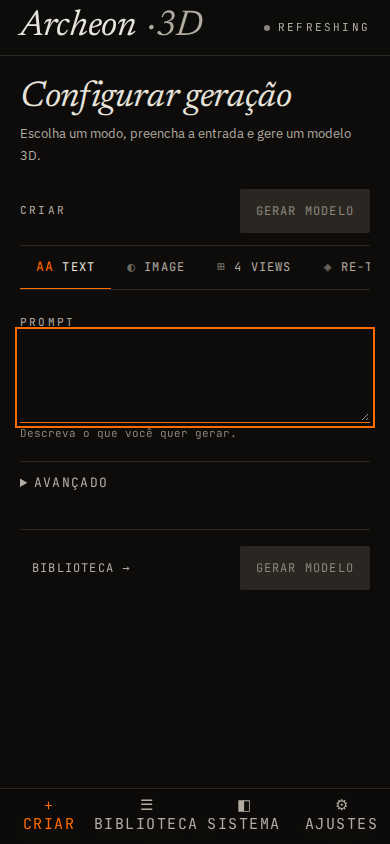

# PolyForge — Do prompt ao polígono

> **A friendly local 3D-generation studio: FastAPI + React + SSE, built on
> [Hunyuan3D-2](https://github.com/Tencent-Hunyuan/Hunyuan3D-2).**
> Type a prompt (or drop in an image), get a GLB mesh back — with live
> progress, a searchable library, and jobs that survive restarts.
>
> All configuration uses the `POLYFORGE_*` env prefix. Pre-rebrand
> environment variables are rejected loudly at startup — rename them
> to `POLYFORGE_*` and restart.

## About

PolyForge turns Hunyuan3D-2 into a real **local service**: queue jobs, stream
status over Server-Sent Events (SSE), persist them in SQLite across restarts,
and drive everything from a React UI or a small CLI. The original 4 request
types (`text_to_3d`, `image_to_3d`, `multiview`, `texture_mesh`) are merged
into a single unified `GenerationRequest` — fill in any combination of inputs
and the backend figures out the rest.

**Who is it for?** Makers, indie game devs, and 3D hobbyists who want
text/image-to-3D on their own machine, without hosting anything remotely.
**What do you need?** Linux (or Windows via the legacy Gradio launcher),
Python 3.10–3.12, Node 22.12+ for the UI, and ideally an NVIDIA GPU —
CPU mode works but is slow and meant for tests.

**Upstream:** models, weights, and the core diffusion/texture research come
from Tencent's Hunyuan3D-2 (see [License](#license) — territory and use
restrictions apply). **This fork** adds the service layer: queue, persistence,
SSE, React studio, CLI, and the smart local installer (`launcher.sh`).

## Screenshots

| Create — pick a mode and generate | Library — history, search, reuse params |
|---|---|
|  |  |

| System — health, queue, warmup | Settings — language and shortcuts |
|---|---|
|  |  |

<details>
<summary>More views (mobile + 1000-job stress test)</summary>

| Mobile create | 1000-job gallery |
|---|---|
|  |  |

</details>

> All screenshots are committed in-repo under `docs/polyforge/` and `docs/`.
> If you re-capture the UI, keep the same filenames so the docs stay in sync.

## Contents

- [Quickstart](#quickstart)
- [Using the studio](#using-the-studio)
- [Using the CLI](#c-quick-cli-run)
- [Environment variables](#environment-variables)
- [Model setup](#model-setup)
- [API surface](#api-surface-summary)
- [Architecture](#architecture)
- [Development](#development)
- [Troubleshooting](#troubleshooting)
- [Docs map](#docs-map)
- [License](#license)
- [About & credits](#about--credits)

## What's in the box

- **Backend** (Python 3.10+, FastAPI, Pydantic v2)
  - `POST /v1/generate` — unified request, 1 endpoint for 4 modes
  - `POST /v1/jobs` — legacy discriminated union (still works, deprecated)
  - `GET /v1/jobs/{uid}/events` — per-job SSE stream
  - `GET /v1/jobs/events` — list-level SSE stream (full snapshot per change)
  - `GET /v1/system/metrics` — CPU/GPU/RAM
  - `POST /v1/meshops/process` — decimate / convert
  - `GET /health` — liveness + readiness with `uptime`, `queue_size`,
    `jobs_in_store`, capabilities
  - SQLite-backed persistence (WAL mode) — survives restarts, replays
    in-flight jobs from their stored payload
  - CLI client (`hy3dgen-cli`) for scripting

- **Frontend** (React 19, Vite, TypeScript)
  - "Laboratory Instrument" design language: off-black warm + amber
    surgical accent, JetBrains Mono for technical labels, Newsreader
    italic for display. Design tokens in `polyforge_frontend/src/design/`.
  - Single dynamic `CreateJobForm` (4 chips: Text / Image / 4 Views / Re-texture)
  - Live `JobGallery` with SSE-backed updates (auto-falls-back to polling)
  - "live / polling / connecting" indicator on every connection
  - Status filter tabs (All / Queued / Processing / Completed / Failed /
    Cancelled), mesh preview, GLB download
  - SystemMonitor sidebar with live CPU/RAM/Jobs-in-mem/Jobs-in-store
    vitals and a status ticker footer that shows the last SSE event

- **Ops** (everything below)
  - `pyproject.toml`, Makefile, `.env.example`, GitHub Actions CI,
    structured logging, local launcher

## Quickstart

### A. Smart local install (recommended)

```bash
git clone https://github.com/yuri-schmaltz/my-hunyuan-3D
cd my-hunyuan-3D
./launcher.sh
```

The launcher checks Python 3.10–3.12, detects an NVIDIA GPU with `nvidia-smi`,
selects CUDA or CPU, creates a local `.venv` and `.env` when missing, installs
the backend and frontend, then starts the API. Open
`http://127.0.0.1:8081`. It never installs system drivers or uses `sudo`.

When the API answers `/health`, the launcher opens the UI in your default
browser automatically (loopback binds only; opt out with `--no-browser`).
It also installs a **PolyForge** entry in the system app menu under
**Graphics**, so you can start it without a terminal
(`make desktop` / `./launcher.sh --install-desktop`; remove with
`make desktop-remove`).

Choose the install mode explicitly when needed:

```bash
./launcher.sh --mode auto      # CUDA when an NVIDIA GPU is usable, otherwise CPU
./launcher.sh --mode cuda      # require a usable NVIDIA driver/GPU
./launcher.sh --mode cpu       # install ML dependencies, run inference on CPU
./launcher.sh --mode api-only  # skip ML and frontend dependencies
```

Weights are downloaded lazily on first use. The launcher can ask whether to
download them during setup, or you can choose `--download-models` and
`--model-scope shape|multiview|tex|t2i|all`. Use `--no-download-models` to skip
the prompt. If Node.js 22.12+ is unavailable, install Node or use
`--no-frontend` for an API-only setup.

### B. Manual local development

Prereqs: Python 3.10–3.12, Node 22.12+; an NVIDIA GPU is optional for CUDA mode.

```bash
git clone https://github.com/yuri-schmaltz/my-hunyuan-3D
cd my-hunyuan-3D
make install           # creates .venv + installs Python deps
make install-frontend  # installs npm deps
make dev               # starts API on :8081 and Vite dev server on :5173
```

Without an NVIDIA GPU, set `POLYFORGE_DEVICE=cpu` in `.env` before `make dev`.
The smart launcher detects this case automatically.

Open <http://localhost:5173> for the UI, or hit the API directly:

For API development without the ML stack, use `make install-api` instead of
`make install`; it starts the service but does not enable model inference.
Texture generation also requires the native rasterizer and mesh processor:
with the CUDA toolkit and a C++ compiler installed, run `make install-native`.

When an API key is configured, the frontend asks for it at runtime. The key
is held in memory and sent with both HTTP and SSE requests. Do not put it
in `VITE_*` build variables. The smart launcher serves the built UI and API
from one loopback origin; `make dev` uses the Vite server on port 5173.

```bash
curl -X POST http://localhost:8081/v1/generate \
  -H "Content-Type: application/json" \
  -d '{"text": "a small red cube", "seed": 1234}'
```

### C. Quick CLI run

```bash
hy3dgen-cli generate --text "a small red cube" --output red.glb
```

The CLI waits for completion, downloads the mesh, and writes it to the
path you passed.

## Environment variables

The full list lives in [`.env.example`](.env.example). The most important
ones:

| Var | Default | Purpose |
|---|---|---|
| `POLYFORGE_API_KEY` | _(empty)_ | When set, requires `X-API-Key` header. Empty = open (dev only). |
| `POLYFORGE_CORS_ORIGINS` | `http://localhost:5173` | Comma-separated allow-list. |
| `POLYFORGE_DEVICE` | `cuda` | `cuda` or `cpu`. CPU is for tests only. |
| `POLYFORGE_MODEL` | `tencent/Hunyuan3D-2` | HuggingFace model id. |
| `POLYFORGE_MODEL_SUBFOLDER` | `hunyuan3d-dit-v2-0` | Geometry checkpoint folder; override together with model id. |
| `POLYFORGE_MULTIVIEW_MODEL` | `tencent/Hunyuan3D-2mv` | Four-view geometry model. |
| `POLYFORGE_MULTIVIEW_SUBFOLDER` | `hunyuan3d-dit-v2-mv` | Four-view checkpoint folder. |
| `POLYFORGE_SAVE_DIR` | `$XDG_CACHE_HOME/hy3dgen/polyforge` | Where generated meshes are written. |
| `POLYFORGE_JOB_DB` | `$XDG_STATE_HOME/hy3dgen/polyforge/jobs.db` | SQLite file. Empty = no persistence. |
| `POLYFORGE_MAX_HISTORY` | `1000` | Cap on in-memory jobs; eviction deletes from DB. |
| `POLYFORGE_LOG_LEVEL` | `INFO` | `DEBUG` / `INFO` / `WARNING` / `ERROR`. |
| `POLYFORGE_LOG_FILE` | _(empty)_ | Optional rotated log file (50 MB × 5). |
| `POLYFORGE_HOST` / `POLYFORGE_PORT` | `127.0.0.1` / `8081` | API bind address. |
| `HF_HOME` | (HF default) | Local HuggingFace model cache. |

The frontend reads its own `polyforge_frontend/.env` — see
[`.env.example`](polyforge_frontend/.env.example).

## Model setup

The first run downloads the models from HuggingFace. To pre-warm or pin
a specific version:

```bash
# Standard shape model (~10 GB on disk)
python -c "from huggingface_hub import snapshot_download; snapshot_download('tencent/Hunyuan3D-2')"

# Optional: paint model for textures (~6 GB)
python -c "from huggingface_hub import snapshot_download; snapshot_download('tencent/Hunyuan3D-2')"
```

Models land in `~/.cache/huggingface` by default — point `HF_HOME` at a
larger disk on a dedicated GPU box.

The legacy launcher provides `mmgp` memory profiles. The API loads geometry,
text-to-image and texture pipelines on demand, but does not yet share the
launcher's offload profiles. Measure VRAM use with your selected models;
low-VRAM operation of the API has not been validated.

## API surface (summary)

### `POST /v1/generate` — unified request

```json
{
  "text": "a small red cube",          // or
  "image": "<base64 png>",             // or
  "views": {                            // or
    "front": "<base64>", "back": "<base64>",
    "left":  "<base64>", "right": "<base64>"
  },
  "mesh": "<base64 glb>",              // for re-texture (with text or image)

  "seed": 1234, "steps": 50, "guidance": 5.0,
  "octree_resolution": 256, "format": "glb",
  "texture": false, "face_count": 40000
}
```

Returns `202` with the same `JobResponse` shape as `POST /v1/jobs`. The
backend infers the mode (text_to_3d / image_to_3d / multiview /
texture_mesh) from the populated fields.

### `GET /v1/jobs/{uid}/events` — per-job SSE

Stream of `event: status` payloads, one per transition. First event is
the current state. Stream closes after a terminal status.

### `GET /v1/jobs/events` — list-level SSE

Stream of `event: list` payloads, each the full sorted job list.
Stream stays open until the client disconnects.

> **Note**: this route is registered *before* the `/v1/jobs/{uid}`
> catch-all in `hy3dgen/api/routes.py`. FastAPI matches in
> declaration order, so if a future refactor reorders them, the
> list-SSE endpoint will silently 404 (the catch-all will see
> `uid="events"` and fail to find a job with that id). There's
> a regression test for this in `tests/test_sse_route_ordering.py`.

> **Note**: this route is registered *before* the `/v1/jobs/{uid}`
> catch-all in `hy3dgen/api/routes.py`. FastAPI matches in
> declaration order, so if a future refactor reorders them, the
> list-SSE endpoint will silently 404 (the catch-all will see
> `uid="events"` and fail to find a job with that id). There's
> a regression test for this in `tests/test_sse_route_ordering.py`.

### `GET /health`

Liveness + readiness with: `model_loaded`, `queue_size`, `jobs_in_store`,
`persistence_enabled`, `auth_required`, `last_error`, `uptime_seconds`.

## Architecture

```
┌─────────────────┐      HTTP/SSE       ┌──────────────────────────┐
│  React frontend │ ───────────────────▶ │  FastAPI (uvicorn)       │
│  (Vite dev or   │ ◀─────────────────── │   ├─ /v1/generate        │
│   API-served dist)│                    │   ├─ /v1/jobs/...        │
│   port 5173/8081│                      │   └─ /v1/jobs/events     │
└─────────────────┘                      │                          │
                                         │  PriorityRequestManager  │
                                         │   ├─ asyncio queue       │
                                         │   ├─ ModelWorker         │
                                         │   └─ JobStore (SQLite)   │
                                         └────────────┬─────────────┘
                                                      │ writes
                                                      ▼
                                         ┌──────────────────────────┐
                                         │  local XDG data/cache     │
                                         │   ├─ meshes/             │
                                         │   ├─ jobs.db (WAL)       │
                                         │   └─ logs/polyforge-api.log│
                                         └──────────────────────────┘
```

## Development

```bash
make help        # show all targets
make install     # full install (Python + ML deps + dev tools)
make dev         # API on :8081 + Vite on :5173
make test        # pytest
make lint        # mypy + tsc + eslint
make build       # build the frontend bundle
make clean       # remove caches + node_modules
make status      # hit /health on a running API
```

## Troubleshooting

**`RuntimeError: No CUDA GPUs are available`**
The launcher could not find a usable NVIDIA GPU. Run `./launcher.sh --mode cpu`
or install/fix the host NVIDIA driver and rerun `./launcher.sh --mode cuda`.

**`HF_HUB_OFFLINE=1` / model download fails**
Pre-download with the `snapshot_download` snippet above. Make sure
`HF_HOME` is on a disk with at least 30 GB free.

**Frontend can't reach the API (CORS)**
When using `make dev`, set `POLYFORGE_CORS_ORIGINS` to include the Vite URL
(`http://localhost:5173`). The smart launcher serves UI and API on one origin.

**`X-API-Key` 401 even though I set the env var**
The API key is loaded once at startup. Restart the API after changing
`POLYFORGE_API_KEY`. The key is logged as `<hidden>` in the health
endpoint when present.

**SSE connection drops after ~1 minute**
If you run a separate reverse proxy, disable response buffering and use a long
read timeout for the `/v1/jobs/events` stream.

## License

Inherits the upstream Tencent Hunyuan3D-2 license (see `LICENSE`).
PolyForge-specific additions are MIT-licensed unless otherwise noted.

## Hardening history

Historical release notes below include deployment features that are no longer
supported; the current installation and run path is local via `launcher.sh`.

This fork ships a 13-PR hardening stack on top of upstream
Hunyuan3D-2. Each PR is linear (`#N` branches from `#N-1`'s tip)
and self-contained, so you can pick the ones you want or take
them all.

| # | Branch | What it does |
|---|---|---|
| 1 | `fix/p0-p1-fixes` | Removes duplicated function defs, fixes `replace_property_getter` typo, silences noisy logs, fixes import error masking. |
| 2 | `feature/followup-improvements` | CI workflow, `/v1/meshops/texture_mesh` endpoint, 3D mesh preview in the gallery. |
| 3 | `feature/security-and-ux-improvements` | API key auth (`X-API-Key`), CORS fix, bounded job history with eviction, multiview tab, state sharing between jobs. |
| 4 | `feature/polish-and-tools` | Former container stack (removed), CLI, mypy config, OpenAPI examples, status filter, integration tests. |
| 5 | `feature/realtime-and-persistence` | SQLite-backed `JobStore`, per-job SSE `/v1/jobs/{uid}/events`. |
| 6 | `feature/payload-rehydrate-and-list-sse` | Rehydrates the original request payload on restart so active jobs can resume; adds list-level SSE `/v1/jobs/events`. |
| 7 | `feature/unified-generation-request` | Single `GenerationRequest` schema with mode inference (text_to_3d / image_to_3d / multiview / texture_mesh). |
| 8 | `feature/out-of-the-box` | `pyproject.toml` packaging, Makefile, CI and README. |
| 9 | `feature/modernize` | Ruff, Pydantic Settings, OpenTelemetry hooks, Prometheus metrics, rate limiting, dep cleanup. |
| 10 | `feature/aiosqlite-and-final-polish` | aiosqlite-backed store, `/v1/admin/stats` endpoint. |
| 11 | `feature/frontend-redesign` | Full UI redesign: "Laboratory Instrument" aesthetic, design tokens, primitive components, 1000-job stress test. |
| 12 | `feature/fix-sse-route-ordering` | Fixes the route-ordering bug that made `/v1/jobs/events` 404 (literal must be declared before the `/jobs/{uid}` catch-all). |
| 13 | `feature/launcher-hardening` | 7 small launcher fixes: `--cache-max-size` flag, `--profile` validation, browser-open waits for `/health`, asset-path resolution via `CURRENT_DIR`, Windows `%LOCALAPPDATA%` cache default, `mmgp>=3.5.0,<3.8`. |
| 14 | `feature/manager-hardening` | `PriorityRequestManager` race conditions: atomic cancel via `_status_transition`, drain queue on shutdown, fix `task_done()` count balance. |

**Test counts**: 222 passed, 1 skipped (OTel) in CI; 14 new
manager-hardening tests are CPU-only and run without a GPU.

**Performance** (measured on a 1000-job store, 50 concurrent clients):
- `/v1/jobs` list endpoint: 2.2 ms p50
- `/health`: 0.6 ms p50
- `/v1/jobs/events` (SSE list): 200 status with `event: list` snapshot
- Rehydrate 10k jobs: 7,371 jobs/s
- Eviction 1000→100: <200 ms

See `docs/STRESS_TEST_REPORT.md` for the full stress test report
and `docs/polyforge/POLYFORGE_ARCH_SPECS.md` for the architecture
specification.
