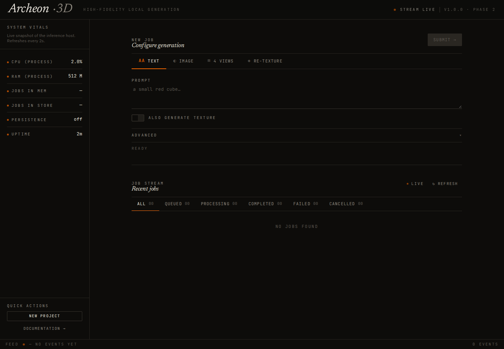
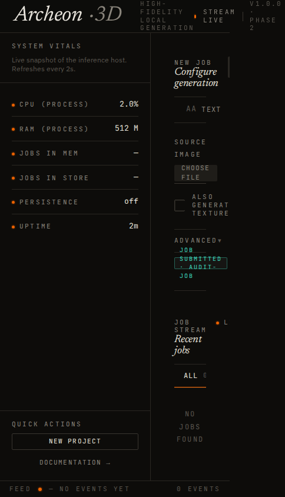

# Archeon 3D — diagnóstico e plano de melhorias

Data: 4 de outubro de 2026. Base analisada: commit `763c35e`.

Este documento preserva o diagnóstico inicial. As correções já executadas e as
validações posteriores estão no [relatório da implementação inicial](IMPLEMENTACAO_ETAPA_1.md).

## 1. Diagnóstico executivo

O Archeon tem uma base tecnológica atual e uma identidade visual própria, mas ainda apresenta inconsistências entre as funcionalidades anunciadas, a API, o worker de inferência e a interface. A prioridade é tornar o fluxo de criação confiável e, em seguida, transformar o painel técnico em um ambiente de trabalho centrado no modelo 3D.

Recomendo preservar React, TypeScript, Vite, FastAPI e o design system existente. O maior ganho vem de corrigir contratos e configuração, melhorar a experiência de geração e consolidar os dois caminhos de inferência: o launcher legado e a API. Uma troca ampla de frameworks acrescentaria custo antes de resolver os problemas observados.

### O que já funciona como base

- Frontend com React 19, TypeScript 5.9, Vite 7 e Tailwind 4; build de produção aprovado nesta análise.
- Tokens de cores, tipografia, espaçamento e componentes visuais reutilizáveis.
- API com modelos Pydantic, fila de prioridade e execução de inferência fora do event loop.
- SQLite com WAL, armazenamento do pedido original e recuperação de trabalhos após reinício.
- SSE da lista de trabalhos, fallback de polling, endpoint de saúde e métricas Prometheus.
- 28 arquivos na pasta de testes; 216 testes aprovados no recorte principal executado.
- Docker, Compose, Makefile e CI já presentes, embora necessitem correções para cumprir o fluxo documentado.

### Avaliação por dimensão

| Dimensão | Estado observado | Principal necessidade |
|---|---|---|
| Tecnologia web | Atual | Consolidar uso e contratos, atualizar com validação |
| Integração funcional | Inconsistente | Corrigir modos, cancelamento, SSE individual e parâmetros |
| Configuração e distribuição | Com bloqueios | Fazer instalação, variáveis e Docker funcionarem de forma coerente |
| UI desktop | Identidade consistente, leitura exigente | Melhorar hierarquia, contraste e destaque do resultado |
| UI móvel | Comprometida | Reorganizar layout e navegação responsiva |
| UX de criação | Básica | Orientação, presets, progresso real e recuperação de erros |
| Histórico e resultados | Limitado | Metadados, busca, detalhes, exportação e retenção explícita |
| Qualidade | Boa base de testes, lacunas nas integrações | Verificar comportamento real entre camadas |

## 2. Método e limites

Foram lidos o frontend, a API, o manager, o worker, a persistência, o launcher, o processamento de malhas, a documentação, o empacotamento e os arquivos de operação. Foram executados build, lint, testes principais, verificações de tipagem e reproduções dirigidas de falhas.

A interface foi aberta em Chromium via Playwright em 1440 × 1000 e 390 × 844. As capturas usam respostas simuladas de métricas e trabalhos, com SSE simulado ativo. O CDN do visualizador foi bloqueado para manter a inspeção independente dessa rede. Portanto, essas capturas demonstram layout e interação, e não validam geração ou renderização de um GLB real.

A inferência com GPU, download de pesos, qualidade das malhas, consumo real de VRAM, build completo das imagens Docker e testes de estresse não foram executados. Os problemas de inferência e Docker apontados abaixo decorrem do caminho de código e da configuração. Estimativas de esforço são de planejamento, não medições de desempenho.





## 3. Problemas encontrados e evidências

P0: bloqueia funcionalidade ou operação básica. P1: prejudica confiabilidade, usabilidade ou manutenção. P2: evolução de produto após estabilização.

| ID | Prioridade | Evidência | Efeito e ação necessária |
|---|---|---|---|
| A01 | P0 | `hy3dgen/api/routes.py:224` chama `manager.cancel_job(uid)` sem `await`; o método é assíncrono | A rota responde que solicitou cancelamento, mas o trabalho permanece na fila. Reproduzido diretamente. Corrigir chamada e retorno; interface deve oferecer cancelamento apenas nos estados suportados. |
| A02 | P0 | `routes.py:183` chama `manager.subscribe(uid)` sem `await` | SSE individual falha com `AttributeError: 'coroutine' object has no attribute 'get'`. Corrigir assinatura e ciclo de vida. Também trocar a comparação `str(job.status)` por valor do enum para encerrar em estado terminal. |
| A03 | P0 | `CreateJobForm.tsx:186` monta o payload a partir de todos os estados preenchidos | Digitar um prompt, mudar para Imagem e escolher um arquivo envia texto e imagem juntos; `GenerationRequest.infer_mode()` escolhe texto. Reproduzido no navegador. Montar payload exclusivamente para o modo selecionado, mantendo rascunhos separados. |
| A04 | P0 | `hy3dgen/inference.py:75` lê apenas `image` ou `text`; multiview chega com `front/back/left/right` | O caminho de API para quatro vistas termina em “No input image or text provided”. Implementar decodificação das vistas e seleção de pipeline compatível; testar até a malha exportada. |
| A05 | P0 | `archeon_frontend/src/api/client.ts`, hooks SSE e `hy3dgen/api/auth.py` | O backend exige `X-API-Key`, mas o frontend não envia a chave. HTTP e SSE precisam compartilhar uma estratégia de autenticação. Não basta adicionar interceptor Axios: os hooks usam `fetch` e `EventSource`. |
| A06 | P0 | `Dockerfile:78` força porta 9000; Compose, nginx e healthcheck usam 8081 | O caminho Docker documentado tem conflito de portas. Remover a sobrescrita ou padronizar entrada, exposição, proxy e healthcheck. Usar base relativa `/v1` no frontend servido pelo nginx. |
| A07 | P0 | `pyproject.toml:7`: versão `2.1.0-archeon7` | Build do wheel falha por versão fora do formato PEP 440. Escolher versão pública válida; consolidar metadados de `setup.py`, `pyproject.toml`, API e UI. |
| A08 | P0 | `config.py:48` mantém `SAVE_DIR` padrão; `server.py` instancia manager sem os settings | `ARCHEON_SAVE_DIR`, `ARCHEON_DEVICE` e `ARCHEON_MAX_HISTORY` não chegam aos consumidores esperados. Reproduzido: configuração `cpu`/12 continua criando manager `cuda`/1000. O diretório de saída também ignora o override, comprometendo a persistência do volume no Docker. Injetar configuração única. |
| A09 | P1 | `manager.py:508` chama `evict_to_size()` assíncrono sem `await` | A limpeza automática não respeita o limite de histórico. Reproduzido com três trabalhos e limite de um. Corrigir execução e esclarecer diferença entre liberar memória e apagar histórico persistente. |
| A10 | P1 | `JobGallery.tsx:111` mantém polling próprio; provider também usa SSE/fallback | Reproduzidas três consultas de lista durante uma breve sessão com SSE ativo. Há duas fontes concorrentes de estado e polling duplicado no fallback. Centralizar atualização no provider/hook. |
| A11 | P1 | `monitoring.py` retorna `uptime_seconds`, `process`, `gpu`; monitor espera também contagens e persistência | UI mostra contagens ausentes e pode mostrar persistência desligada por falta de campo. Separar métricas de processo e estado operacional, ou fornecer um DTO agregado; desconhecido deve aparecer como “indisponível”. |
| A12 | P1 | `schemas.JobResponse` não inclui `request_type` nem `updated_at`; frontend espera ambos | A lista exibe tipo “unknown” e eventos não têm timestamp próprio de transição. Definir contrato canônico, metadados úteis e tipos gerados a partir do OpenAPI. |
| A13 | P1 | `meshops/process` monta destino relativo; `MeshProcessor.process()` exporta nesse caminho | O arquivo otimizado pode ficar fora de `/files`, quebrando o download. Usar diretório de artefatos configurado, validar formato e retornar URL/identificador de artefato. A API de decimação usada também não existe no Trimesh 5.1.1 resolvido nesta auditoria; fixar compatibilidade e validar a operação real. |
| A14 | P1 | `MAX_MESH_BYTES = 100 MB`, quatro imagens de até 20 MB; nginx limita corpo a 64 MB | Base64 aumenta o volume em aproximadamente um terço: mesh de 100 MB vira cerca de 133 MB, além do JSON. Alinhar limites totais imediatamente; depois migrar para upload binário com referências de arquivos. |
| A15 | P1 | Manager carrega textura e texto-imagem junto com o primeiro worker; API não usa os perfis de offload do launcher | Risco de consumo desnecessário de VRAM em uma proposta de uso local. Carregar recursos por demanda e compartilhar políticas de memória/modelos entre launcher e API; medir em GPUs de referência. |
| A16 | P1 | `ModelWorker.generate()` sempre remove fundo; conversão multiview descarta `texture=True` | Parâmetros aceitos pelo contrato não são respeitados integralmente. Validar cada opção até o worker e documentar suporte por modelo. |
| A17 | P1 | `delete_older_than()` usa `datetime.utcnow().timestamp()`; datas são persistidas sem timezone | O teste de retenção remove dois registros quando esperava um no ambiente local; o mesmo teste passa com `TZ=UTC`. Padronizar UTC com timezone e testar limites em UTC e America/Sao_Paulo. |
| A18 | P1 | CI chama mypy com diretórios sobrepostos; usa `--timeout` sem incluir `pytest-timeout` no extra de desenvolvimento | Comando de mypy falha por módulo duplicado. Testes de estresse podem falhar por setup e suas falhas são convertidas em avisos. Corrigir dependências/comandos e distinguir falhas funcionais de variação de performance. |
| A19 | P1 | Instalação de API depende indiretamente de Torch/Trimesh; `requirements.txt` e extra `ml` divergem em `mmgp` | A instalação leve anunciada não corresponde aos imports; o teste inicial falhou na coleta por Trimesh ausente. Separar dependências e imports opcionais, gerar lock por perfil e testar instalação limpa. |

Há ainda pontos a corrigir no ciclo da fila: `_process_queue()` pode executar `task_done()` duas vezes ao pular um item cancelado, e `stop()` cancela a task antes de assegurar a drenagem prevista. Verificar shutdown, reinício e balanceamento da fila com o manager real, sem depender apenas de stubs.

## 4. Direção de UI/UX

### Preservar a identidade e melhorar a legibilidade

Preservar o fundo escuro quente, o destaque laranja e a tipografia serifada da marca. Usar IBM Plex Sans para instruções, textos de ajuda e conteúdo; reservar JetBrains Mono para valores e identificadores. Reduzir caixa alta e espaçamento excessivo entre letras em textos frequentes.

O token `--color-fg-dim: #5a564f` tem contraste calculado de aproximadamente 2,68:1 sobre `#0d0c0a`. Ele aparece em placeholders, metadados e informações de estado. Revisar tokens de texto informativo para contraste mínimo de 4,5:1 no tamanho normal, conforme [WCAG 2.2](https://www.w3.org/WAI/WCAG22/Understanding/contrast-minimum.html). O tom vermelho também merece ajuste: sobre esse fundo ficou em aproximadamente 4,48:1, abaixo do limiar.

### Organizar a interface pelo trabalho do usuário

Proposta de navegação: **Criar**, **Biblioteca**, **Sistema** e **Configurações**. A seção Sistema deve concentrar métricas detalhadas; o estado essencial da GPU/modelo permanece visível em uma linha compacta no ambiente de criação.

No desktop, o ambiente Criar pode ter configuração à esquerda, viewport 3D central e detalhes do trabalho selecionado em painel lateral ou gaveta. A fila fica próxima ao resultado. Implementar esse layout depois de validar um protótipo com tarefas reais; para a primeira entrega, basta reordenar os componentes existentes e tornar a prévia mais acessível.

```text
Desktop
┌──────────────── marca · navegação · conexão ────────────────┐
│ Entrada e opções │ Viewport 3D / orientação inicial         │
│ Modo + referência│                                         │
│ Preset + avançado│ Etapa atual · fila · duração             │
│ Gerar modelo     │ Resultado · exportar · detalhes          │
└──────────────────┴─────────────────────────────────────────┘

Mobile
Marca + menu → entrada → opções → gerar → progresso → resultado
Métricas e detalhes abrem em painel recolhível.
```

No viewport de 390 px, a sidebar atual ocupa 256 px, restando 134 px para o main; o conteúdo interno chega a 455 px e é cortado. Transformar a sidebar em drawer/recolhível, reduzir padding lateral e permitir quebra ou rolagem controlada das abas. Verificar 360, 390, 768 e 1440 px, além de zoom de 200%.

### Tornar a criação guiada e previsível

- Exibir uma explicação breve de cada modo, com exemplo e formatos aceitos.
- Upload com arrastar e soltar, clique, prévia, substituir e remover arquivo; informar limite antes da seleção.
- Quatro vistas com posições ilustradas e instruções para manter objeto, escala e iluminação consistentes.
- Presets “Rápido”, “Equilibrado” e “Detalhado”, vinculados ao modelo e ao hardware. Os valores precisam ser medidos; não assumir que o mesmo número de steps serve para todos os modelos.
- Manter controles técnicos em Avançado, com explicação de seed, guidance, resolução e número de faces.
- Usar um `<form>` real, validação antes do envio e mensagens específicas por campo; `min/max` atuais não impedem o envio pelo handler do botão.
- CTA “Gerar modelo” no final do formulário e acessível em telas pequenas. Mostrar resumo do que será solicitado e se textura está incluída.
- Preservar dados quando houver erro, identificar o trabalho enviado e abrir seu acompanhamento; oferecer reutilização dos parâmetros após conclusão.
- Ocultar ou desabilitar com explicação modos indisponíveis no modelo carregado, com base em capacidades informadas pelo backend.

### Dar visibilidade ao andamento e à recuperação

Exibir estados distintos: enviando arquivos, na fila, carregando modelo, preparando entrada, gerando geometria, texturizando, exportando, concluído e falhou. Etapas devem vir do backend. Percentual e previsão de duração só devem aparecer quando houver dados reais para sustentá-los.

Para falhas, mostrar causa compreensível, detalhe técnico expansível e ação adequada: corrigir entrada, tentar novamente, reduzir qualidade ou consultar configuração. A lista atual não apresenta `job.error` junto do trabalho que falhou.

Separar “API acessível”, “autenticação necessária”, “conectado por SSE”, “atualizando por polling” e “modelo pronto”. `stream idle` não explica ao usuário se a geração está disponível. O botão Atualizar deve forçar uma leitura mesmo quando SSE estiver ativo.

### Transformar resultados em uma biblioteca útil

Mostrar miniatura, nome editável, origem, data completa, status e duração. Permitir busca e filtros por modo, status e data; detalhar parâmetros, erros e arquivos de saída. Adotar paginação no servidor antes de renderizar um histórico crescente.

Ações prioritárias: visualizar, baixar, reutilizar parâmetros, gerar variante e exportar formato suportado. Otimização deve apresentar redução desejada, estimativa de faces quando disponível e estado de execução; hoje o ícone aplica 50% diretamente. Preservar o original e registrar o artefato derivado.

No visualizador, adicionar estado de carregamento/erro, reset de câmera, controle de rotação automática e informações básicas da malha. Empacotar o componente localmente e esperar `customElements.whenDefined()`, evitando que uma checagem inicial de registro mantenha o fallback após o script carregar. Adicionar recursos como wireframe apenas se a demanda justificar a complexidade de outro viewer.

### Acessibilidade e acabamento

- Títulos semânticos `h1/h2`: na página principal inspecionada, ambos estavam ausentes.
- Foco visível em abas, arquivos, toggle e ações; `role=tab` deve vir acompanhado de comportamento de teclado e relacionamento com os painéis, conforme [WAI-ARIA APG](https://www.w3.org/WAI/ARIA/apg/patterns/tabs/).
- Associar ajuda e erros aos campos e anunciar submissão/conclusão com `aria-live` adequado.
- Alvos principais confortáveis para toque, preferencialmente 44 px; verificar o mínimo de 24 × 24 px ou espaçamento equivalente e suas exceções na [WCAG 2.2](https://www.w3.org/WAI/WCAG22/Understanding/target-size-minimum.html).
- Respeitar redução de movimento também nas animações JavaScript e na rotação 3D.
- Definir português como opção de interface, preparar catálogo de mensagens e formatar datas/números por locale.
- Ligar “Documentation” à documentação real e substituir “New project” por uma ação implementada; ambos estão sem handler.
- Substituir favicon Vite e versões fixas por identidade e versão efetivas do produto.

## 5. Plano de ação por etapas

Estimativa: **6–8 semanas para um desenvolvedor full stack com acesso à GPU de validação**, com revisão de design e testes de uso. A correção de pipelines/modelos pode ampliar esse prazo. Organizar as entregas por critérios de aceite, não apenas por datas.

| Etapa | Esforço estimado | Entregas | Dependências e critério de aceite |
|---|---|---|---|
| 1. Estabilização funcional — P0 | 1–2 semanas | Cancelamento e SSE individual; payload por modo; multiview; autenticação HTTP/SSE; configuração efetiva; portas Docker; versão Python válida | Primeira etapa. Instalação limpa e Compose saudáveis; quatro modos respeitam a entrada escolhida e chegam ao worker correto; geração e download reais validados em GPU para os modos declarados disponíveis. |
| 2. Contratos e operação — P1 | 1–2 semanas | Tipos a partir de OpenAPI; metadados de trabalho; provider único; reconexão e polling; UTC; métricas coerentes; artefatos; limites de upload; CI corrigida | Depende dos contratos estabilizados. Uma fonte de estado; sem polling recorrente com SSE saudável; cancelamento/estado terminal/reinício corretos; exportação/otimização baixáveis; checks reproduzíveis. |
| 3. Fundação visual e formulário — P1 | Cerca de 1 semana | Protótipo do fluxo; tokens acessíveis; layout responsivo; campos/abas; upload; presets iniciais; ajuda e mensagens; ações reais | Usa contratos e capacidades definidos. Fluxo utilizável em 360–1440 px, por teclado e com zoom; modo e arquivos sempre claros; erros preservam rascunho. |
| 4. Ambiente de criação e resultados — P1/P2 | 1–2 semanas | Viewport em destaque; progresso por etapa; detalhe do trabalho; biblioteca com miniaturas/busca/paginação; reutilização e exportação | Progresso e metadados dependem do backend. Usuário consegue criar, acompanhar, inspecionar, baixar e repetir um resultado sem buscar identificadores técnicos. |
| 5. Eficiência de inferência e polimento — P2 | Cerca de 1 semana | Carregamento por demanda; perfis de memória compartilhados; benchmarks; budgets de bundle; locale; onboarding; documentação consolidada | Comparar com baseline da mesma GPU/modelo. Melhora de uso medida; funcionalidades disponíveis coerentes com hardware; checklist de instalação e operação aprovado. |

O carregamento desnecessário de modelos deve ser antecipado para a etapa 1 se bloquear a GPU usada para validar o produto. Melhorias de legibilidade e responsividade podem começar enquanto os testes de GPU são preparados, sem ampliar o escopo de implementação dos contratos.

### Primeiros tickets sugeridos

1. **Corrigir regressões async nas rotas e na limpeza:** `await`, enums terminais, fila e shutdown; testes de rota com manager real e worker substituído por implementação controlada.
2. **Isolar entradas por modo e alinhar capabilities:** serialização tipada, validação e casos de troca entre todas as abas.
3. **Fechar o caminho multiview até a inferência:** carregar modelo adequado, encaminhar vistas e preservar parâmetros suportados; fixture leve mais teste em GPU.
4. **Unificar Settings e a inicialização:** diretório, device, modelos, retenção e limites; smoke com overrides efetivamente aplicados.
5. **Restaurar instalação e Docker:** versão PEP 440, dependências API/ML, build de wheel, porta única e comunicação pelo proxy.
6. **Definir autenticação para o frontend:** opção local com chave informada em runtime e SSE por cliente que suporte headers; para acesso compartilhado, sessão no servidor/proxy. Não embutir chave em variável `VITE_*`. O [EventSource nativo](https://developer.mozilla.org/en-US/docs/Web/API/EventSource/EventSource) não oferece parâmetro para headers arbitrários.
7. **Consolidar estado e conexões do frontend:** remover polling da galeria, reconectar com backoff, interromper requisições antigas e atualizar imediatamente ao voltar à aba.
8. **Entregar layout responsivo e legibilidade:** drawer de sistema, títulos, contraste, foco e CTA; smoke visual nos viewports definidos.

## 6. Modernização arquitetural proposta

Manter a implantação simples, com um processo de API e um worker de inferência por GPU nesta fase. Múltiplos workers Uvicorn hoje criariam managers, filas e modelos independentes; não tratar isso como mecanismo de escalabilidade da inferência.

Extrair um serviço de inferência compartilhado pelo launcher e pela API, com interfaces para carregamento, capabilities, progresso e políticas de memória. Aplicar injeção de configuração e carregamento opcional das dependências pesadas. Isso reduz divergência sem exigir a reescrita do código upstream dos modelos.

Usar um contrato público de trabalho com `mode`, timestamps em UTC, etapas, parâmetros, erro estruturado e referências de artefatos. Manter compatibilidade dos endpoints existentes durante a migração. URLs de download devem ser retornadas pelo backend, em vez de o frontend reconstruí-las a partir de caminhos do sistema operacional.

Separar retenção da memória, retenção do histórico e retenção de arquivos. Hoje eviction também apaga registros SQLite, enquanto arquivos podem permanecer. Definir política explícita e limpeza consistente, com histórico paginado no banco.

Aplicar limites à fila e aos uploads no servidor e tratar consumidores SSE lentos com buffers limitados/snapshots recentes. Manter snapshots completos enquanto o volume justificar; adotar eventos incrementais após medir tamanho e frequência. Proteger artefatos conforme o modo de acesso: `/files` hoje é montado sem a autenticação de `/v1`.

Consolidar dependências e versões compatíveis por perfil API/ML/dev; padronizar a versão do produto em formato [PEP 440](https://packaging.python.org/en/latest/specifications/version-specifiers/). Reduzir o bundle carregando o viewer por demanda e restringindo famílias/pesos/subsets de fonte aos necessários. O bundle atual de JavaScript ficou em 392,78 kB, ou 128,29 kB gzip; esse número não inclui o viewer externo.

Adicionar cache de dados ou roteamento quando a divisão em Biblioteca/Sistema/Configurações exigir. Redis, Celery, PostgreSQL, microserviços e um editor 3D completo ficam condicionados a necessidades medidas de distribuição, concorrência ou edição; não são dependências iniciais deste plano.

## 7. Verificação executada e metas de qualidade

| Verificação | Resultado nesta análise |
|---|---|
| `npm ci --no-audit --no-fund` | Aprovada; lockfile utilizado |
| `npm run build` | Aprovada: TypeScript + Vite |
| `npm run lint` | Zero erros; um warning de ref no cleanup do hook de lista |
| Pytest principal, Python 3.12 | 216 aprovados, um falhou; 192 warnings. Excluídos testes de imports/texgen e quatro grupos de estresse/concorrência/memória |
| Retenção reexecutada com `TZ=UTC` | Aprovada, reforçando o problema de timezone |
| Wheel com `python -m build --wheel --no-isolation` | Falhou: `project.version` precisa ser PEP 440 |
| Mypy com comando equivalente ao CI | Falhou: módulo duplicado por caminhos sobrepostos |
| Mypy reexecutado somente sobre `hy3dgen` | 183 erros em 26 arquivos com Mypy 2.4.0; corrigir também o escopo das exclusões do código upstream |
| Ruff em `hy3dgen/api` | Aprovado |
| Ruff em `hy3dgen tests`, como no CI | 521 ocorrências com Ruff 0.16.10; muitas de formatação/imports. Tratar separadamente das falhas funcionais |
| Navegador desktop/mobile | Sem exceções de página no cenário simulado; falhas de layout móvel e contaminação entre modos reproduzidas |
| Rotas e configuração, verificações dirigidas | Cancelamento sem efeito, SSE individual quebrado, limpeza sem efeito e overrides ignorados reproduzidos |

O backend foi testado em ambiente temporário, instalando dependências sem instalar o projeto, pois o empacotamento falha. Foram usados Python 3.12.3, Pydantic 2.13.5, FastAPI 0.142.2, Trimesh 5.1.1 e dependências resolvidas sem lock do backend. Essa verificação descreve o checkout com esse ambiente; não estabelece compatibilidade de todos os intervalos declarados. O frontend foi testado com Node 22.23.2 e o lockfile do repositório.

Metas propostas para as entregas:

- Testes de contrato/fluxo dos quatro modos, incluindo alternância de aba, autenticação, cancelamento, retomada e downloads.
- Falha de persistência visível operacionalmente, sem apresentar como durável um trabalho que não foi armazenado.
- Uma conexão SSE de lista por aba; polling apenas quando necessário; reconexão e atualização manual verificadas.
- Todas as variáveis documentadas com smoke de configuração e instalação limpa por perfil.
- Biblioteca com paginação e cenário de 1000 registros sem renderização integral da lista; definir orçamento de latência a partir da medição inicial.
- Leitura e navegação por teclado verificadas; nenhum conteúdo essencial cortado nos viewports de referência; contraste e semântica auditados.
- Benchmark em hardware identificado: tempo de carregamento, tempo de geração por etapa, pico de VRAM e qualidade de saída para cada preset. Estabelecer metas após esse baseline.
- Teste de uso com 3–5 pessoas: criar por imagem, acompanhar, recuperar um erro, baixar e repetir. Usar os resultados para ajustar a etapa 4.

## 8. Resultado esperado

Ao final das primeiras duas etapas, o Archeon deve cumprir de maneira verificável as capacidades já anunciadas. As etapas seguintes devem entregar um fluxo de criação claro, responsivo e centrado no resultado 3D, com suporte operacional que explica disponibilidade e falhas. O investimento principal é consolidar o produto existente e reduzir sua distância entre intenção, código e comportamento.
